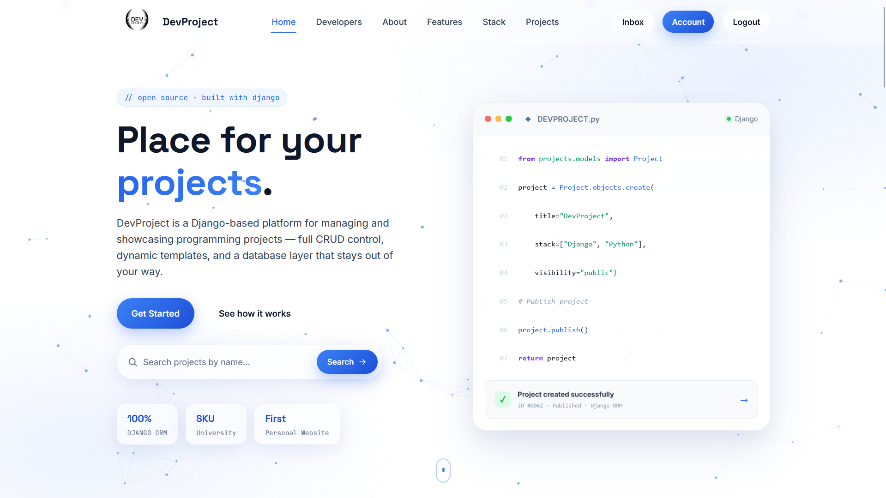
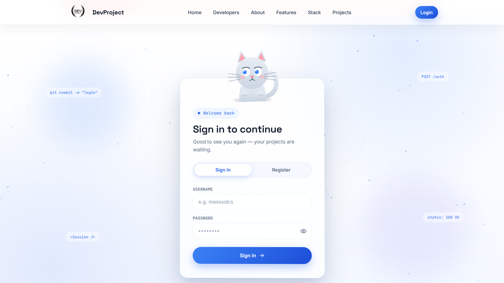
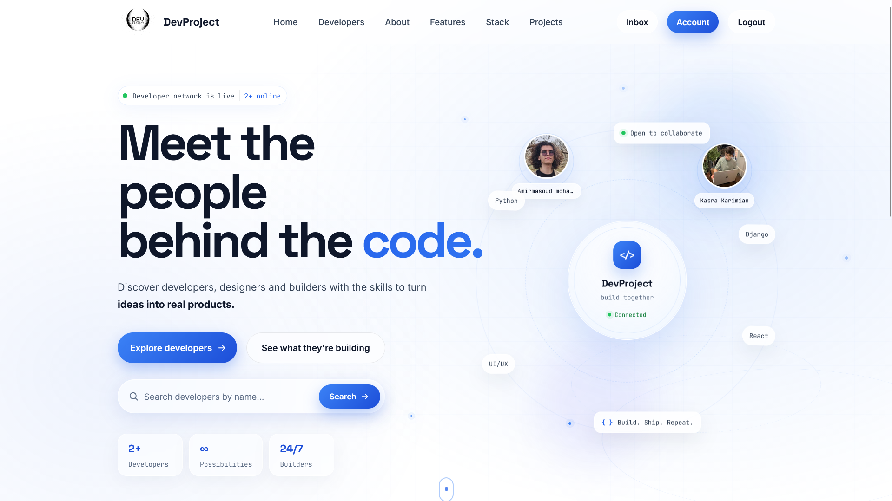
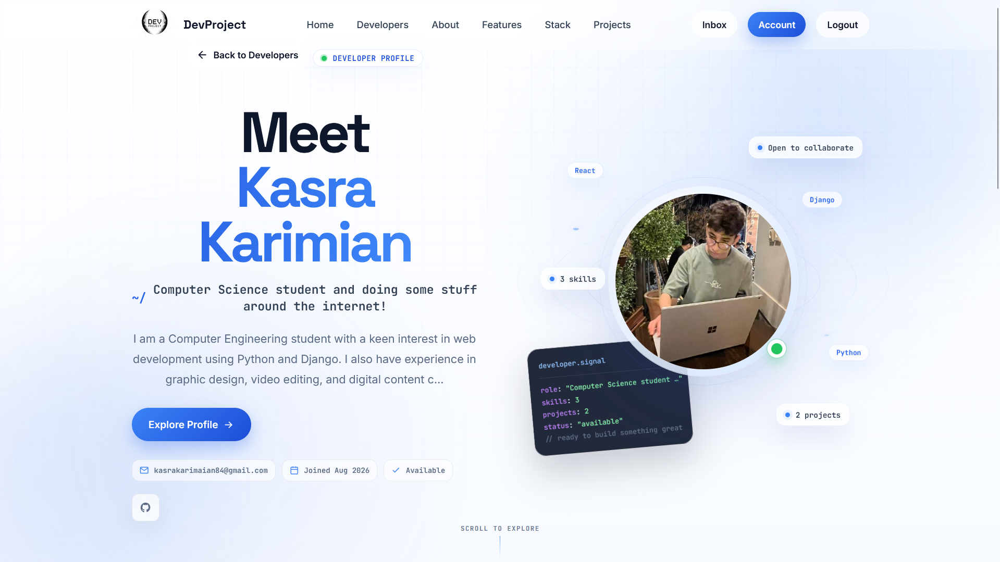
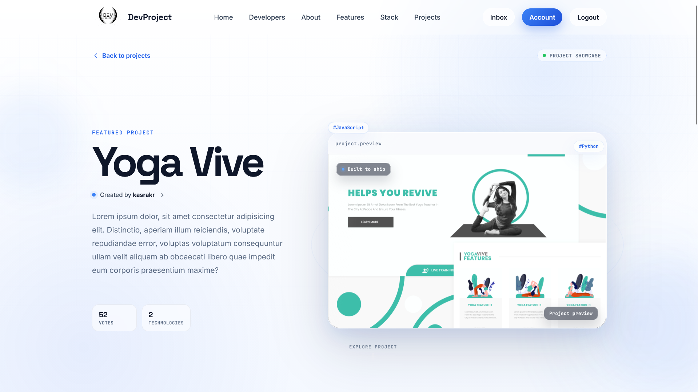
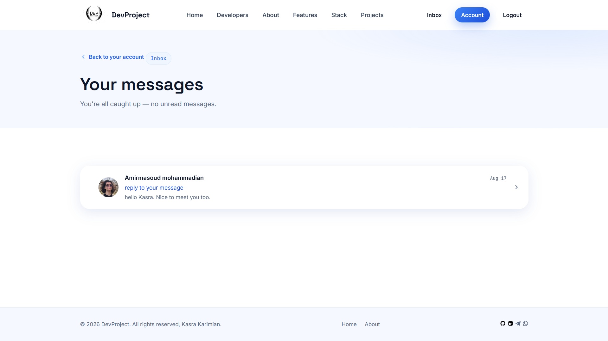

<a id="readme-top"></a>


<div align="center">

# DevProject

[](https://github.com/kasrakr/My-Devproject-Website)

A full-stack Django platform where developers build a profile, publish their projects with tags &amp; screenshots, get up/down-voted and reviewed by the community, and message each other directly — all wrapped in a no-framework front end.

<p>
  
  
  
  
</p>
<p>
  
  
  
</p>


</div>

## 📖 Table of Contents

- [About the Project](#-about-the-project)
- [Preview](#-preview)
- [Features](#-features)
- [Tech Stack](#-tech-stack)
- [Project Structure](#-project-structure)
- [Getting Started](#-getting-started)
- [Usage](#-usage)
- [Roadmap](#-roadmap)
- [Contributing](#-contributing)
- [License](#-license)
- [Contact](#-contact)

---

## 🧭 About the Project

**DevProject** is a Django web app I built to learn the framework properly, end to end — not just a to-do list, but a real multi-app project with authentication, relational data, file uploads, search, and a messaging system. It's a small community where developers can:

- create a public profile and list their skills,
- publish the projects they've built, complete with tags, a demo link and source code,
- get feedback from other developers through up/down-votes and written reviews,
- and message each other directly through a private inbox.

It's my first website, and it's the project that made Django click for me — everything from the models to the templates to the vanilla CSS was my first experience in Web Developing.

<p align="right">(<a href="#readme-top">back to top</a>)</p>

## 🖼️ Preview


<div align="center">
  
</div>

<details>
<summary><b>➕ More views (click to expand)</b></summary>
<br>

<table>
<tr>
<td align="center" width="100%">
<br/>
<sub>Login page</sub>
</td>
</tr>
<tr>
<td align="center" width="100%">
<br/>
<sub>Developers</sub>
</td>
</tr>
<tr>
<td align="center" width="100%">
<br/>
<sub>Developer profiles</sub>
</td>
</tr>
<tr>
<td align="center" width="100%">
<br/>
<sub>Project details page</sub>
</td>
</tr>

<td align="center" width="100%">
<br/>
<sub>Messaging inbox</sub>
</td>

</table>


</details>

<p align="right">(<a href="#readme-top">back to top</a>)</p>

## ✨ Features

|     | Feature | Description |
|:---:|---|---|
| 👤 | **Developer Profiles** | Bio, location, short intro, a list of skills, and social links (GitHub, LinkedIn, Telegram, WhatsApp, YouTube, personal site). |
| 🗂️ | **Project Showcase** | Publish projects with a title, description, tags, a featured image, a live demo link and a source-code link. |
| 🔍 | **Live Search & Tag Filtering** | Search projects and developers by title, description, owner name or tag, powered by a custom `Q`-lookup query. |
| ⭐ | **Voting & Reviews** | Up-vote or down-vote any project with a written review — one review per person per project. `vote_total` and `vote_ratio` recalculate automatically. |
| ✉️ | **Private Messaging** | A built-in inbox lets developers message each other, with an unread-count badge in the navbar and read/unread ordering. |
| 🖼️ | **Image Uploads** | Profile pictures and project screenshots, with sensible default images when nothing's been uploaded yet. |
| 🛠️ | **Full CRUD** | Create, update and delete your own projects straight from the site. |
| 🔐 | **Authentication** | Registration, login/logout and an account page, built on Django's auth system. |
| 🧑‍💻 | **Admin Panel** | Manage every model — profiles, projects, tags, reviews, messages — from the Django admin. |

<p align="right">(<a href="#readme-top">back to top</a>)</p>

## 🧱 Tech Stack

<div align="center">
  
  
  
  
  
  
  
</div>

<p align="center"><sub>Front end is hand-rolled — vanilla CSS &amp; JavaScript, no UI framework.</sub></p>

<p align="right">(<a href="#readme-top">back to top</a>)</p>

## 📁 Project Structure

```text
My-Devproject-Website/
├── devproject/            # Project config — settings, root URLs, WSGI/ASGI
├── projects/               # Projects app
│   ├── models.py           # Project, tag, review
│   ├── views.py             # List, detail, create/update/delete, voting
│   ├── forms.py
│   ├── utils.py             # Search & filtering logic
│   └── templates/projects/
├── users/                    # Users app
│   ├── models.py             # profile, Skill, Message
│   ├── views.py               # Auth, profiles, account, inbox
│   ├── signals.py
│   └── templates/users/
├── templates/                 # Shared layout (navbar, base page)
├── static/                     # Source CSS / JS / images
├── staticfiles/                 # Collected static files (generated)
├── manage.py
└── db.sqlite3
```

<p align="right">(<a href="#readme-top">back to top</a>)</p>

## ⚙️ Getting Started

### Prerequisites

- Python 3.x
- pip

### Installation

```bash
# 1. Clone the repository
git clone https://github.com/kasrakr/My-Devproject-Website.git
cd My-Devproject-Website

# 2. Create & activate a virtual environment
python -m venv venv
source venv/bin/activate        # Windows: venv\Scripts\activate

# 3. Install dependencies
pip install django pillow

# 4. Apply migrations
python manage.py migrate

# 5. Create an admin account
python manage.py createsuperuser

# 6. Run the development server
python manage.py runserver
```

Then open **http://127.0.0.1:8000** 🎉

<p align="right">(<a href="#readme-top">back to top</a>)</p>

## 🧭 Usage

1. **Register** an account (or log in).
2. Go to **Account** and fill out your profile — bio, skills, avatar, social links.
3. Click **Create Project** to publish something you've built.
4. Browse **Developers**, or use the search bar to filter projects by tag, title or owner.
5. Open any project to leave an **up-vote / down-vote** with a written review.
6. Check your **Inbox** for messages from other developers.
7. Log in as a superuser and visit `/admin/` to manage everything from one place.

<p align="right">(<a href="#readme-top">back to top</a>)</p>

## 🗺️ Roadmap

- [x] Developer profiles & authentication
- [x] Project CRUD with tags & image uploads
- [x] Live search & tag filtering
- [x] Voting & review system
- [x] Private messaging inbox
- [ ] Email notifications for new users
- [ ] REST API
- [ ] Deploy a live demo

See the [issues page](https://github.com/kasrakr/My-Devproject-Website/issues) for open items — new ideas are welcome.

<p align="right">(<a href="#readme-top">back to top</a>)</p>

## 🤝 Contributing

This started as a learning project, so feedback and pull requests are extra welcome.

1. Fork the project
2. Create your feature branch (`git checkout -b feature/AmazingFeature`)
3. Commit your changes (`git commit -m "Add AmazingFeature"`)
4. Push to the branch (`git push origin feature/AmazingFeature`)
5. Open a Pull Request

<p align="right">(<a href="#readme-top">back to top</a>)</p>

## 📄 License

Distributed under the **MIT License**. See [`LICENSE`](./LICENSE) for details.

## 📬 Contact

**Kasra Karimian**

<div align="center">
  <a href="https://github.com/kasrakr">
    
  </a>
  <a href="https://linkedin.com/in/kasrakarimian" >
  
</a>
<a href="https://t.me/lowkasra">
  
</a>
<a href="mailto:kasrakarimaian84@gmail.com" >
  
</a>
</div>

<p align="right">(<a href="#readme-top">back to top</a>)</p>

---

<details>
<summary>⭐ Star History</summary>

</details>

<div align="center">

If this project helped you learn something, consider giving it a ⭐ — it means a lot for me!

</div>


